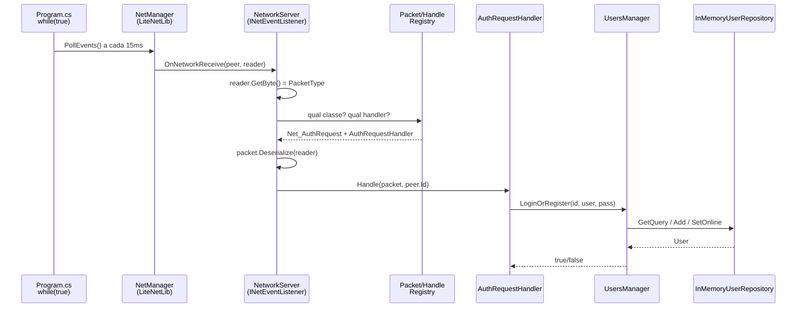
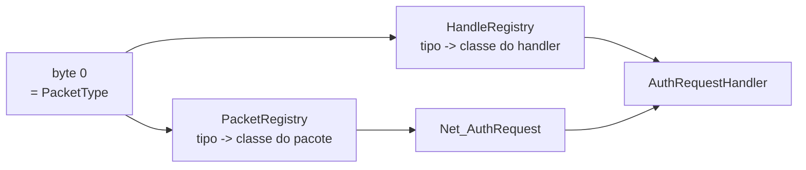

# TTT.Server

Servidor autoritativo do Tic Tac Toe multiplayer. Console app .NET 10 rodando UDP
confiável via **LiteNetLib**, na porta `9050`.

O cliente é o projeto Unity na raiz do repositório. Os dois compilam **o mesmo
código de rede** (`NetworkShared/` e `Assets/Lib/LiteNetLib/`, incluído via
`<Compile Include="../Assets/Lib/LiteNetLib/**/*.cs" />` no csproj), então
protocolo dessincronizado entre cliente e servidor é impossível por construção.

## Rodando

```bash
make run      # dotnet run
make watch    # rebuild automático a cada alteração
make build
```

## Como funciona

O LiteNetLib **não tem thread própria aqui**. Ele enfileira os eventos de rede e
só os entrega quando alguém chama `PollEvents()` — quem dirige tudo é o
`while(true)` do `Program.cs`:

```csharp
while (true)
{
    server.PollEvents();
    Thread.Sleep(15);
}
```

Isso é um game loop, não o modelo thread-por-conexão do Netty ou de um servlet
container. **Tudo roda numa thread só.** Duas consequências:

- Não há concorrência sobre o estado do servidor — o `List<User>` do repositório
  e o `Dictionary` de conexões não precisam de lock.
- Um `Handle` lento trava *todos* os clientes. Mesmo raciocínio de não bloquear
  a event loop do Node.

### Caminho de um pacote



O primeiro byte de todo pacote é o `PacketType` (`NetworkShared/PacketType.cs`).
A partir dele, dois registries resolvem o resto:



Ambos são varreduras de assembly no startup — o equivalente ao `@ComponentScan`
do Spring — que substituem um `switch` que cresceria a cada pacote novo:

| | descobre pela | análogo Java |
|---|---|---|
| `PacketRegistry` | propriedade `Type` da própria classe do pacote | interface implementada |
| `HandleRegistry` | atributo `[HandlerRegister(PacketType.X)]` no handler | `@EventListener` |

### Adicionando um pacote novo

1. Adicione o valor no enum `PacketType` (`< 100` cliente→servidor, `>= 100`
   servidor→cliente).
2. Crie a classe do pacote em `NetworkShared/Packets/` implementando
   `INetPacket` (`Type`, `Serialize`, `Deserialize`).
3. Crie o handler implementando `IPacketHandler`, anotado com
   `[HandlerRegister(PacketType.X)]`.

Nenhum arquivo de registro precisa ser editado — os registries e o
`AddPacketHandlers()` encontram tudo por reflection.

## Estrutura

```
Program.cs           game loop: Start() + PollEvents() a cada 15ms
NetworkServer.cs     INetEventListener do LiteNetLib; roteia pacotes
Infra/Container.cs   composition root do DI
Extensions/          AddPacketHandlers(): scan e registro dos handlers
NetworkShared/       protocolo — compartilhado com o cliente Unity
  PacketType.cs      enum : byte, o primeiro byte do pacote
  Packets/           Net_AuthRequest, ...
  Registries/        PacketRegistry, HandleRegistry
  Attributes/        HandlerRegisterAttribute
PacketHandler/       um handler por PacketType
Game/                estado de jogo em memória
  UsersManager.cs    login/registro; mapeia connectionId -> ServerConnection
  ServerConnection.cs
Data/                persistência
  User.cs, IRepository<T>, IUserRepository, InMemoryUserRepository
```

## Ciclo de vida no DI (`Infra/Container.cs`)

| serviço | ciclo | por quê |
|---|---|---|
| `NetworkServer`, `UsersManager`, `IUserRepository` | Singleton | guardam estado; recriar = perder as conexões e os usuários |
| registries | Singleton | scan de assembly é caro, roda uma vez |
| handlers | Scoped | um escopo novo por pacote recebido (`OnNetworkReceive`) |

`AddTransient`/`AddScoped` num repositório in-memory daria a cada consumidor uma
lista vazia recém-criada. Comparando com Spring: `AddSingleton` é o
comportamento padrão de um `@Component`; quem foge do padrão Java é o
`AddTransient`.

## Estado atual

Funcionando: conexão, deserialização, roteamento, login/registro em memória.

Pendências conhecidas:

- **Servidor não responde ao cliente.** `NetworkServer` não expõe nenhum `Send`;
  o resultado do login só vai para o log. Falta o pacote `OnAuth` (já reservado
  no enum).
- **`OnPeerDisconnected` não avisa o `UsersManager`.** `UsersManager.Disconnect()`
  nunca é chamado, então nenhum usuário fica offline.
- **Dois mapas de conexão paralelos**: `Dictionary<int, NetPeer>` no
  `NetworkServer` e `Dictionary<int, ServerConnection>` no `UsersManager`. O
  `ServerConnection.Peer` fica `null` porque o `NetPeer` não é repassado no
  login.
- **Senhas em texto puro**, comparadas com `!=`. Trocar por hash antes de
  qualquer coisa que saia da máquina local.
- **Repositório in-memory** com 3 usuários fake (`player1/2/3`, senha `123456`)
  criados no construtor. Nada persiste entre execuções.
